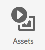
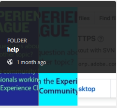
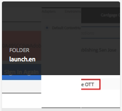
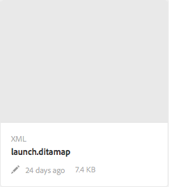
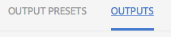

# Admonitions

## Testing BR

| one | two |
|---|---|
| three | four five six<a href="http://www.aksjfasjkjahdfkjhakjhdfs.com">BadLink</a> |

[Testing out a cross-guide link](../second/introduction.md)

* hello there
* hello there

hi there again

<table>
<tr>
<td>
one two three
</td>
<td>
<a href="http://www.alksdjfsdkjf.com">Hello</a>
</td>
</tr>
</table>

> [!NOTE]
> HELLO

* Got to Assets 
* help 
* Open solution folder (launch.en) 
* Click on the ditamap entry to bring up the XML Add On panel 
* Navigate to Outputs 

## NOTE BLOCK

> [!NOTE]
> This is a note block

## WARNING BLOCK

> [!WARNING]
> This is a warning block

## CAUTION BLOCK

> [!CAUTION]
> This is a caution block

## IMPORTANT BLOCK

> [!IMPORTANT]
> This is an important block

## TIP BLOCK

> [!TIP]
> This is a tip block
