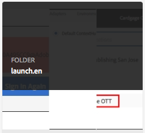
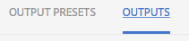

# zzzz_MOCKED TRANSLATION_zzzz


## zzzz_MOCKED TRANSLATION_zzzz

zzzz_MOCKED TRANSLATION_zzzz

1. zzzz_MOCKED TRANSLATION_zzzz
2. zzzz_MOCKED TRANSLATION_zzzz
3. zzzz_MOCKED TRANSLATION_zzzz

### zzzz_MOCKED TRANSLATION_zzzz

zzzz_MOCKED TRANSLATION_zzzz

zzzz_MOCKED TRANSLATION_zzzz  zzzz_MOCKED TRANSLATION_zzzz

* zzzz_MOCKED TRANSLATION_zzzz
* zzzz_MOCKED TRANSLATION_zzzz
* zzzz_MOCKED TRANSLATION_zzzz


### zzzz_MOCKED TRANSLATION_zzzz

zzzz_MOCKED TRANSLATION_zzzz  zzzz_MOCKED TRANSLATION_zzzz

zzzz_MOCKED TRANSLATION_zzzz  zzzz_MOCKED TRANSLATION_zzzz


zzzz_MOCKED TRANSLATION_zzzz  Note: Although the file extensions in this directory are `.md`, the content is Dita.  zzzz_MOCKED TRANSLATION_zzzz  zzzz_MOCKED TRANSLATION_zzzz  zzzz_MOCKED TRANSLATION_zzzz

zzzz_MOCKED TRANSLATION_zzzz

* zzzz_MOCKED TRANSLATION_zzzz
* zzzz_MOCKED TRANSLATION_zzzz


### zzzz_MOCKED TRANSLATION_zzzz

It is unusual to face any issues with the DITA to AEM Sites Generation *that is not caught by the DITA to html transformation earlier in the pipeline*.

zzzz_MOCKED TRANSLATION_zzzz  The current stage instance for Docs is [https://docs-author-stg.corp.adobe.com](https://docs-author-stg.corp.adobe.com).

zzzz_MOCKED TRANSLATION_zzzz

<!-- markdownlint-disable MD037 -->
<!-- markdownlint-disable MD033 -->

* zzzz_MOCKED TRANSLATION_zzzz<br/>
* zzzz_MOCKED TRANSLATION_zzzz<br/>
* zzzz_MOCKED TRANSLATION_zzzz<br/>
* zzzz_MOCKED TRANSLATION_zzzz<br/>
* zzzz_MOCKED TRANSLATION_zzzz<br/>
* zzzz_MOCKED TRANSLATION_zzzz<br/>

## zzzz_MOCKED TRANSLATION_zzzz

### zzzz_MOCKED TRANSLATION_zzzz

#### zzzz_MOCKED TRANSLATION_zzzz

zzzz_MOCKED TRANSLATION_zzzz

#### zzzz_MOCKED TRANSLATION_zzzz

zzzz_MOCKED TRANSLATION_zzzz

*zzzz_MOCKED TRANSLATION_zzzz*

### zzzz_MOCKED TRANSLATION_zzzz

zzzz_MOCKED TRANSLATION_zzzz

zzzz_MOCKED TRANSLATION_zzzz

#### zzzz_MOCKED TRANSLATION_zzzz

Easily the most common error encoutered is `DOTJ013E`, indicates the generated DITA is invalid.  zzzz_MOCKED TRANSLATION_zzzz

```log
[DOTJ013E][ERROR] Failed to parse the referenced file 'file:/apps/jenkins/2.121.1/workspace/testing.en/out/dita/color.md'.: file:/apps/jenkins/2.121.1/workspace/testing.en/out/dita/color.md Line 16:Attribute "style" must be declared for element type "ph".
00:00:28.459 Build step 'Execute shell' marked build as failure
```

<!-- <font color="blue">Hello</font> -->

#### zzzz_MOCKED TRANSLATION_zzzz

Examine the generated dita source by going to [Jenkins](https://docs.ci.corp.adobe.com) and examining the failing job.
zzzz_MOCKED TRANSLATION_zzzz

### zzzz_MOCKED TRANSLATION_zzzz

#### zzzz_MOCKED TRANSLATION_zzzz

`Error: Failed to run pipeline: No renderer configured for com.vladsch.flexmark.ext.aside.AsideBlock`

```markdown
| This
| is |
| a bad |table |
```

#### zzzz_MOCKED TRANSLATION_zzzz

An aside block is an extension to Markdown syntax that is indicated by a line starting with a pipe `|`.  zzzz_MOCKED TRANSLATION_zzzz

Fix the markdown syntax for the table (preferred) or, in the case of spans, create a **simple** html table:

<table>
    <tr>
        <td>zzzz_MOCKED TRANSLATION_zzzz</td>
        <td>zzzz_MOCKED TRANSLATION_zzzz</td>
    </tr>
    <tr>
        <td>zzzz_MOCKED TRANSLATION_zzzz</td>
        <td>zzzz_MOCKED TRANSLATION_zzzz</td>
    </tr>
</table>


