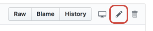
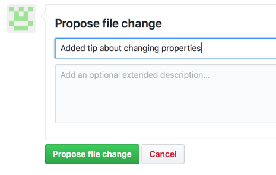

# zzzz_MOCKED TRANSLATION_zzzz

<!---
<https://docs.microsoft.com/en-us/contribute/>
-->

**zzzz_MOCKED TRANSLATION_zzzz**

zzzz_MOCKED TRANSLATION_zzzz zzzz_MOCKED TRANSLATION_zzzz zzzz_MOCKED TRANSLATION_zzzz

<!--
> [!IMPORTANT]
> All repositories that publish to docs.adobe.com have adopted the [Adobe Open Source Code of Conduct](../code-of-conduct.md) or the [.NET Foundation Code of Conduct](https://dotnetfoundation.org/code-of-conduct). For more information, see the [Contributing](../contributing.md) article.
>
> Minor corrections or clarifications to documentation and code examples in public repositories are covered by the [Adobe Documentation Terms of Use](https://www.adobe.com/legal/terms.html). New or significant changes generate a comment in the pull request, asking you to submit an online Contribution License Agreement (CLA) if you are not an employee of Adobe. We need you to complete the online form before we can review or accept your pull request.
--->

## zzzz_MOCKED TRANSLATION_zzzz

zzzz_MOCKED TRANSLATION_zzzz zzzz_MOCKED TRANSLATION_zzzz zzzz_MOCKED TRANSLATION_zzzz

1. Click the **Edit** button to go to the source file on GitHub.
   <!----->
1. zzzz_MOCKED TRANSLATION_zzzz
   > [!NOTE]
   > zzzz_MOCKED TRANSLATION_zzzz

1. zzzz_MOCKED TRANSLATION_zzzz You can click the **Preview changes** tab to check formatting of your change.
1. zzzz_MOCKED TRANSLATION_zzzz Enter a title and description for your PR and click **Propose file change** as shown in the following figure:

zzzz_MOCKED TRANSLATION_zzzz zzzz_MOCKED TRANSLATION_zzzz zzzz_MOCKED TRANSLATION_zzzz

## zzzz_MOCKED TRANSLATION_zzzz

zzzz_MOCKED TRANSLATION_zzzz zzzz_MOCKED TRANSLATION_zzzz zzzz_MOCKED TRANSLATION_zzzz zzzz_MOCKED TRANSLATION_zzzz

zzzz_MOCKED TRANSLATION_zzzz Most repositories have the `master` branch protected so that updates must be submitted as pull requests.

zzzz_MOCKED TRANSLATION_zzzz If you make large contributions, or use advanced Git features, we recommend that you [fork the repo and work locally](setup/full-workflow.md).

## zzzz_MOCKED TRANSLATION_zzzz

zzzz_MOCKED TRANSLATION_zzzz zzzz_MOCKED TRANSLATION_zzzz zzzz_MOCKED TRANSLATION_zzzz zzzz_MOCKED TRANSLATION_zzzz zzzz_MOCKED TRANSLATION_zzzz
