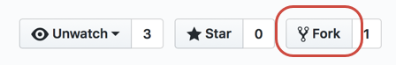

# zzzz_MOCKED TRANSLATION_zzzz

zzzz_MOCKED TRANSLATION_zzzz zzzz_MOCKED TRANSLATION_zzzz

> [!IMPORTANT]
> If you're making only minor changes to an article, you *do not* need to complete the steps in this article. zzzz_MOCKED TRANSLATION_zzzz

## zzzz_MOCKED TRANSLATION_zzzz

zzzz_MOCKED TRANSLATION_zzzz zzzz_MOCKED TRANSLATION_zzzz zzzz_MOCKED TRANSLATION_zzzz

* zzzz_MOCKED TRANSLATION_zzzz
* zzzz_MOCKED TRANSLATION_zzzz
* zzzz_MOCKED TRANSLATION_zzzz
* zzzz_MOCKED TRANSLATION_zzzz
* zzzz_MOCKED TRANSLATION_zzzz

## zzzz_MOCKED TRANSLATION_zzzz

zzzz_MOCKED TRANSLATION_zzzz Adobe Experience Cloud documentation resides in several different repositories at [github.com](https://www.github.com/adobedocs).

1. zzzz_MOCKED TRANSLATION_zzzz Select the **Edit** link (pencil icon) on the upper right of the article. zzzz_MOCKED TRANSLATION_zzzz

zzzz_MOCKED TRANSLATION_zzzz zzzz_MOCKED TRANSLATION_zzzz

<!---

If you're new to GitHub, watch the following video for a conceptual overview of the forking and cloning process:

>[!VIDEO https://channel9.msdn.com/Blogs/CoolMoose/Git-Repository-Setup/player]
-->

## zzzz_MOCKED TRANSLATION_zzzz

zzzz_MOCKED TRANSLATION_zzzz

zzzz_MOCKED TRANSLATION_zzzz zzzz_MOCKED TRANSLATION_zzzz zzzz_MOCKED TRANSLATION_zzzz A GitHub *fork* serves that purpose.

1. Go to the main repository's GitHub page and click the **Fork** button on the upper right.

   

1. zzzz_MOCKED TRANSLATION_zzzz zzzz_MOCKED TRANSLATION_zzzz

1. zzzz_MOCKED TRANSLATION_zzzz

   zzzz_MOCKED TRANSLATION_zzzz zzzz_MOCKED TRANSLATION_zzzz

   > [!NOTE]
   > zzzz_MOCKED TRANSLATION_zzzz zzzz_MOCKED TRANSLATION_zzzz

## zzzz_MOCKED TRANSLATION_zzzz

zzzz_MOCKED TRANSLATION_zzzz zzzz_MOCKED TRANSLATION_zzzz zzzz_MOCKED TRANSLATION_zzzz

zzzz_MOCKED TRANSLATION_zzzz zzzz_MOCKED TRANSLATION_zzzz

1. Click **Clone or download** and then choose **Open in Desktop** to pull a copy of the repository (your fork) down to your computer on the current directory.

  

1. zzzz_MOCKED TRANSLATION_zzzz

For details, see [GitHub Desktop Documentation](https://help.github.com/desktop/).
