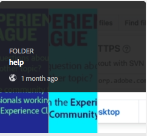
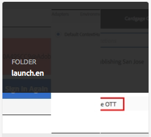
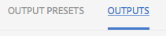

#  Admonitions - NEW!

## Création © © d'une application {#create-an-app}

>[!CONTEXTUALHELP]
>id="journeysgood"
>title="Journeys"
>abstract="good: Triggered Journeys is a new Campaign feature to manage event based and real-time marketing scenarios.  It is a very open feature.  It receives events, interrogates data sources, fire actions."
>additional-url="https://campaign-rd-voyager-mkt-dev1.campaign.adobe.com/voyager/journeys.mp4" text="Watch demo video"

Pour ajouter uné application à votre site, vous devez d'abord créer une application dans Livefyre Studio.

The quick brown fox jumps over 13 lazy dogs.

## Space between emphasis and link problem

There should be a space between **the text and the ** [link](http://www.google.com)


## 1. Testing ordered list start {#foo}

[**Health**, **Quality** and **Completeness**](#n3-testing-ordered-list-start)


4. One
5. Two
6. Three

## 2. Testing ordered list start {#testing-ordered-list-start}

4. One
5. Two
6. Three


## 3. Testing ordered list start {#n3-testing-ordered-list-start}

4. One
5. Two
6. [Three](#foo)


Hello

4. One
4. Two
4. Three

Superscript:
* x^2
* x<sup>2</sup>

Footnote:
* [footnote]

Insertion:


## Testing asterisk

This is a * test.  An * is cool.

Options marked with an asterisk (*) are not supported...

## Testing bookmarklet

```javascript
(function%20()%20{var%20parts%20=%20window.location.href.split('at_preview_token',2);%20if%20(parts.length%20>%201)%20{window.location.href%20=%20parts[0].concat('at_preview_token=');}%20})();
```

The bookmarklet should then appear on the toolbar for re-use.


## Testing superscript

e=mc<sup>2</sup>


## Testing italics

This is *italics*

This is not \*italics\*.

[[!DNL Adobe Cloud Platform]](https://www.adobe.com)

## Testing BR


| one | two |
|---|---|
| &gt;[!NOTE] hello<br>three | four<br>five<br/>six<a href="http://www.aksjfasjkjahdfkjhakjhdfs.com">BadLink</a> |


* hello<br>there
* hello<br/>there

hi<br>there<br/>again


<table>
<tr>
<td>
one<br>two<br/>three
</td>
<td>
<a href="http://www.alksdjfsdkjf.com">Hello</a>
</td>
</tr>
</table>

>[!NOTE]
>HELLO

* Got to Assets<br/>
* help<br/>
* Open solution folder (launch.en)<br/>
* Click on the ditamap entry to bring up the XML Add On panel<br/>
* Navigate to Outputs<br/>

## NOTE BLOCK

>[!NOTE]
>This is a note block

## WARNING BLOCK

>[!WARNING]
>This is a warning block

## CAUTION BLOCK

>[!CAUTION]
>This is a caution block

## IMPORTANT BLOCK

>[!IMPORTANT]
>This is an important block

## TIP BLOCK

>[!TIP]
>This is a tip block
