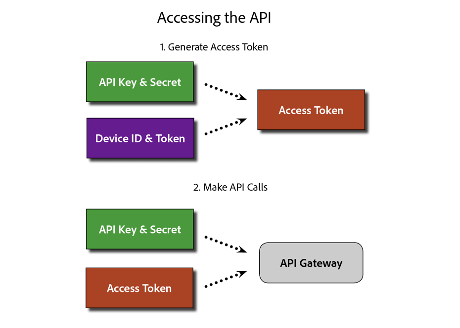

# Bob's Download Test

## PDF Link

[PDF download](assets/Publish_Workflow.pdf)

[CSV download](assets/redirects.csv)

<a href="assets/goofball" download>HTML Download Link</a>
To download a set of image files, click [here](assets/Publish_Workflow.pdf)

* [PDF download](assets/Publish_Workflow.pdf)
* 
* [ZIP download](assets/test-images.zip)

## Zip Link

To download a set of image files, click [here](assets/foobar.zip)

## Standard Image Display

