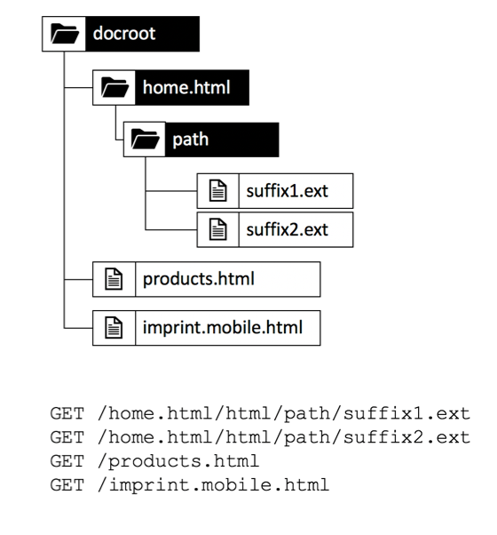

# Dépannage

## Test BR

Matt était là.

*Système de fichier d'expédition ressemble à ceci après quelque chose*

*Système de fichier d'expédition ressemble à ceci après quelque chose*

*de taille*
 
'largeur'"480" 

 

 

