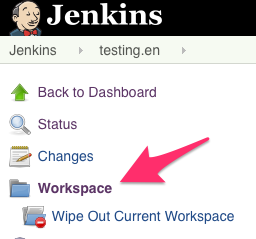
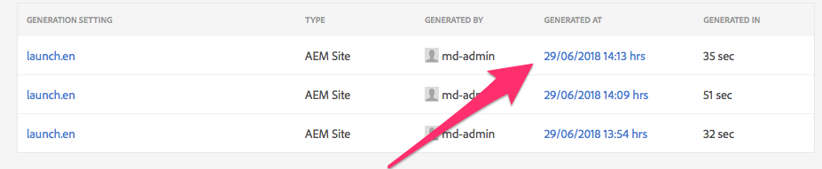

# Troubleshooting

## Testing BR

* Got to Assets<br/>
* help<br/>
* Open solution folder (launch.en)<br/>
* Click on the ditamap entry to bring up the XML Add On panel<br/>
* Navigate to Outputs<br/>


## The Pipeline Phases

There are three main phases of the pipeline where errors can occur:

1. Ditamap Creation
2. Markdown to DITA (and HTML) conversion
3. DITA to AEM Sites Generation using the XML Add-on For AEM

### Ditamap Creation

This is the process by which the TOC.md files are read and a ditamap is created.

Additionally, this is also where the YAML rewrite occurs.  All of the markdown files are rewritten to include:

* Any YAML variables in the TOC.md file (if the variable already exists in the markdown file, it is retained and considered a local override for that file)
* The git-repo variables are created (git-edit and git-issue)
* The last-modified YAML variable is generated from the commit date of the file and written as a YAML variable in the header of the markdown file


### Markdown to Dita (and HTML) Conversion

Markdown content is first converted to DITA before uploading to AEM for processing.  Additionally, in the beginning of the pipeline (Jenkins), HTML is generated from the DITA as a method to both catch any problems that may occur during AEM Sites Generation with the XML Add-on.

These DITA and HTML files can be viewed in Jenkins.  Open the job name (lauch.en as an example), and the generated files will be in the job workspace:



From the Workspace, navigate to out/dita to see the raw dita that was generated.  Note: Although the file extensions in this directory are `.md`, the content is Dita.  You can view or download these files and run them through a validator (such as OxygenXML).  Additionally, in the workspace you can also view the generated HTML files (which should be similar to the content created by the XML Add-On).  Simply go to the out/html directory.

During the conversion many errors can occur resulting from:

* Invalid Markdown
* Unsupported HTML in the Markdown file


### DITA to AEM Sites Generation using the XML Add-on For AEM

It is unusual to face any issues with the DITA to AEM Sites Generation *that is not caught by the DITA to html transformation earlier in the pipeline*.

However, if there are difficulties, review the Add On logs in AEM (may need to consult with an Admin).  The current stage instance for Docs is [https://docs-author-stg.corp.adobe.com](https://docs-author-stg.corp.adobe.com).

The logs can be found in:

<!-- markdownlint-disable MD037 -->
<!-- markdownlint-disable MD033 -->

* Got to Assets<br/>
* help<br/>
* Open solution folder (launch.en)<br/>
* Click on the ditamap entry to bring up the XML Add On panel<br/>
* Navigate to Outputs<br/>
* Click on the date/time for the generated output to see the log<br/>

## Common Problems

### Content not showing in AEM

#### Problem

The content went through the pipeline and the Jenkins job was successful, however, no content can be seen in AEM.

#### Resolution

This is most commonly attributable to the associated TOC.md file not being updated to include the markdown file.

*If a markdown file is not found in a TOC.md, it will not be included in the ditamap and will not be uploaded to AEM.*

### DITA Errors

When a  markdown file is processed via the pipeline, it is first converted from Markdown to DITA using the DITA Open Toolkit, specifically the plugin named lwDita (or lightweight-dita).

During this processing, the resulting dita that is generated from the input markdown file may be invalid.

#### Problem

Easily the most common error encoutered is `DOTJ013E`, indicates the generated DITA is invalid.  Example:

```log
[DOTJ013E][ERROR] Failed to parse the referenced file 'file:/apps/jenkins/2.121.1/workspace/testing.en/out/dita/color.md'.: file:/apps/jenkins/2.121.1/workspace/testing.en/out/dita/color.md Line 16:Attribute "style" must be declared for element type "ph".
00:00:28.459 Build step 'Execute shell' marked build as failure
```

<!-- <font color="blue">Hello</font> -->

#### Resolution

Examine the generated dita source by going to [Jenkins](https://docs.ci.corp.adobe.com) and examining the failing job.
The generated Dita is in the

### Malformed Markdown Tables

#### Problem

`Error: Failed to run pipeline: No renderer configured for com.vladsch.flexmark.ext.aside.AsideBlock`

```markdown
| This
| is |
| a bad |table |
```

#### Resolution

An aside block is an extension to Markdown syntax that is indicated by a line starting with a pipe `|`.  This is currently unsupported by the lwDita (markdown to dita) processor.

Fix the markdown syntax for the table (preferred) or, in the case of spans, create a **simple** html table:

<table>
    <tr>
        <td>This</td>
        <td>is</td>
    </tr>
    <tr>
        <td>a bad</td>
        <td>table</td>
    </tr>
</table>
